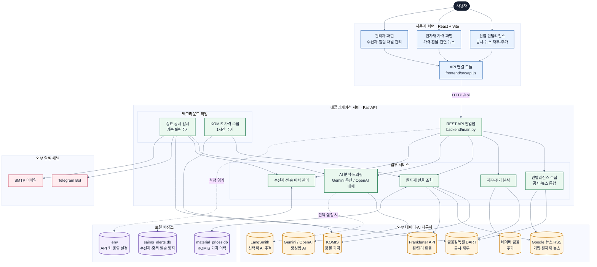

# FUTURE:M RADAR

POSCO퓨처엠을 중심으로 경쟁사·고객사의 공시, 뉴스, 재무정보를 모니터링하고 AI 브리핑을 제공하는 분리형 웹 애플리케이션입니다.

## 원자재 가격 전용 화면 (KOMIS)

- 왼쪽 `원자재 가격` 메뉴로 이동합니다. 산업 인텔리전스에는 가격 위젯을 표시하지 않습니다.
- `backend/services/komis_service.py`가 KOMIS 공개 홈페이지의 차트 조회 요청을 `requests`로 읽습니다. 비공식 웹 응답이므로 사이트 개편 시 수정이 필요합니다. 로그인 우회는 하지 않습니다.
- 서버 시작 시, 이후 1시간마다 수집합니다. 브라우저가 닫혀 있어도 백엔드가 실행 중이면 동작합니다. 단일 uvicorn worker로 실행하세요.
- `/api/materials`와 화면 새로고침은 저장된 가격만 읽습니다. 화면은 10초마다 저장 상태를 재조회하며 KOMIS에 직접 요청하지 않습니다.
- 공개 차트가 제공하는 이력부터 수집하고 이후 축적합니다. 기간 버튼은 확보된 이력만 표시합니다. 단위·가격 규격·기준일을 함께 표시하고, 등락률은 직전 공표 가격 대비 계산합니다.
- SQLite `data/material_prices.db`의 `komis_prices`에 저장합니다. 기존 SMM 데이터와 통화·규격을 혼합하지 않습니다. 실패 시 마지막 값을 유지하며 오류와 시도 시각을 표시합니다.
- 리튬·니켈·코발트·망간 4개 품목을 표시합니다. 망간은 KOMIS의 `Mn 75%min, C 2%max EXW China` 규격이며 원문 단위 `USD/mt`를 유지합니다.
- KOMIS 저작권 정책은 회사 내부 이용·재배포에 제한을 명시합니다. 사내 운영 및 외부 배포 전 한국광해광업공단에 허용 범위를 확인하세요. 이 구현은 이용 허락을 대신하지 않습니다.

## 실행 구조

아래 그림은 **사용자 요청이 화면에서 시작해 외부 데이터 수집·AI 분석·알림으로 이어지는 전체 흐름**을 보여줍니다. GitHub에서 바로 읽을 수 있도록 위에서 아래로 배치하고, 글자 크기를 기본 Mermaid보다 크게 설정했습니다.



### 그림 읽는 순서

1. **사용자는 세 가지 화면을 이용합니다.** 일반 대시보드에서는 기업 공시·뉴스·재무·주가를 보고, 원자재 화면에서는 광물 가격과 환율을 확인합니다. 관리자 화면에서는 알림 수신자와 채널을 관리합니다.
2. **모든 화면 요청은 `api.js`를 거쳐 FastAPI로 전달됩니다.** 개발 환경에서는 Vite가 `/api` 요청을 `http://localhost:8001`로 프록시합니다.
3. **FastAPI는 기능별 서비스에 일을 나눕니다.** DART 공시·재무, Google 뉴스, 네이버 주가, KOMIS 가격, 환율을 각각 수집하고 필요한 경우 Gemini 또는 OpenAI로 분석합니다.
4. **주기 작업은 브라우저와 독립적으로 실행됩니다.** 중요 공시 감시는 기본 5분마다 실행되어 Telegram·이메일을 발송하고, KOMIS 가격은 1시간마다 수집됩니다. 따라서 자동 수집과 알림을 사용하려면 백엔드가 계속 실행 중이어야 합니다.
5. **SQLite는 두 목적별로 분리됩니다.** `saims_alerts.db`는 수신자와 발송 이력을 보관해 중복 알림을 막고, `material_prices.db`는 원자재 가격 이력을 저장합니다.

### 대표 요청 흐름

- **대시보드 조회:** 사용자 → React 화면 → FastAPI → DART·Google 뉴스 → 통합 결과 → 화면
- **AI 브리핑:** 공시·뉴스·원자재 근거 → Gemini 우선 분석 → 실패하거나 미설정이면 OpenAI 시도 → 브리핑 표시
- **중요 공시 알림:** 백그라운드 감시 → DART 공시 확인 → AI 요약 → 수신자·발송 이력 확인 → Telegram·이메일 발송
- **원자재 조회:** 1시간 주기 KOMIS 수집 → SQLite 저장 → `/api/materials`가 저장값 조회 → 화면 표시

> [!NOTE]
> `LangSmith`는 `LANGSMITH_API_KEY`가 있을 때만 AI 요청 추적에 사용됩니다. 외부 API 키가 없거나 외부 서비스가 일시적으로 실패해도 가능한 범위에서 빈 결과 또는 마지막 저장값을 사용하도록 구성되어 있습니다.

## 중요 공시 이메일 알림

- 관리자 페이지에서 수신자 이름과 이메일을 등록하고 Telegram·Email 채널을 각각 켜거나 끌 수 있습니다.
- `.env`에 `SMTP_HOST`, `SMTP_PORT`, `SMTP_USERNAME`, `SMTP_PASSWORD`, `SMTP_FROM_EMAIL`을 설정하면 중요 공시 감지 및 테스트 버튼에서 HTML/텍스트 이메일을 함께 발송합니다.
- Gmail은 `smtp.gmail.com:587`과 STARTTLS를 사용합니다. Google 계정에서 2단계 인증을 켠 뒤 발급한 16자리 앱 비밀번호를 `SMTP_PASSWORD`에 입력해야 하며, 일반 Gmail 로그인 비밀번호는 사용하지 않습니다.
- SMTP 비밀번호는 관리자 API로 반환하지 않으며 `.env`는 Git에서 제외됩니다. 기존 Telegram 수신자와 발송 이력은 신규 다중 채널 테이블로 자동 이전됩니다.

- Frontend: React, Vite, Lucide React
- Backend: FastAPI, OpenDartReader, feedparser, Gemini/OpenAI, pandas
- Frontend: `http://localhost:5173`
- Backend API: `http://localhost:8001`
- API 문서: `http://localhost:8001/docs`

```text
FUTURE_M_RADAR/
├─ frontend/
│  ├─ src/
│  │  ├─ App.jsx          # 화면 및 사용자 흐름
│  │  ├─ api.js           # 백엔드 API 연결
│  │  └─ styles.css       # 디자인 시스템
│  ├─ package.json
│  └─ vite.config.js
├─ backend/
│  ├─ services/
│  │  ├─ dart_service.py
│  │  ├─ news_service.py
│  │  ├─ finance_service.py
│  │  ├─ ai_service.py
│  │  └─ telegram_service.py
│  ├─ config.py
│  ├─ schemas.py
│  └─ main.py             # FastAPI 진입점
├─ .env
├─ .env.example
└─ requirements.txt
```

## 설치

Backend:

```powershell
python -m venv .venv
.\.venv\Scripts\Activate.ps1
pip install -r requirements.txt
```

Frontend:

```powershell
cd frontend
npm install
```

## 환경변수

`.env.example`을 `.env`로 복사한 뒤 API 키를 입력합니다.

```env
DART_API_KEY=
GEMINI_API_KEY=
GEMINI_MODEL=gemini-flash-lite-latest
OPENAI_API_KEY=
TELEGRAM_BOT_TOKEN=
TELEGRAM_CHAT_ID=
LANGSMITH_API_KEY=
LANGSMITH_PROJECT=FUTURE-M-RADAR
LANGSMITH_ENDPOINT=https://api.smith.langchain.com
ADMIN_PASSWORD=
ALERT_POLL_SECONDS=300
ALERT_DATABASE_PATH=data/saims_alerts.db
```

`LANGSMITH_API_KEY`를 입력하면 AI 분석 요청·응답, 실행시간 및 오류가
`FUTURE-M-RADAR` 프로젝트에 자동으로 기록됩니다. 키가 비어 있으면 추적은
자동으로 비활성화됩니다.

## Telegram 자동 중요 공시 알림

관리자 페이지는 `http://localhost:5173/admin`에서 접속합니다. `.env`의
`ADMIN_PASSWORD`로 로그인한 뒤 Telegram 수신자의 이름과 `chat_id`를
등록할 수 있습니다. 수신자는 BotFather로 만든 봇과 먼저 대화를 시작해야
하며, 활성 수신자에게 오늘 접수된 주요 계약·투자·증자 공시가 기본 5분
간격으로 중복 없이 자동 발송됩니다. 운영 배포 시에는 반드시 HTTPS와
충분히 강력한 관리자 비밀번호를 사용하세요.

## 실행

터미널 1 — Backend:

```powershell
.\.venv\Scripts\python.exe -m uvicorn backend.main:app --reload --port 8001
```

터미널 2 — Frontend:

```powershell
cd frontend
npm run dev
```

브라우저에서 `http://localhost:5173`을 엽니다.

## 빌드

```powershell
cd frontend
npm run build
```

빌드 결과는 `frontend/dist`에 생성됩니다.
